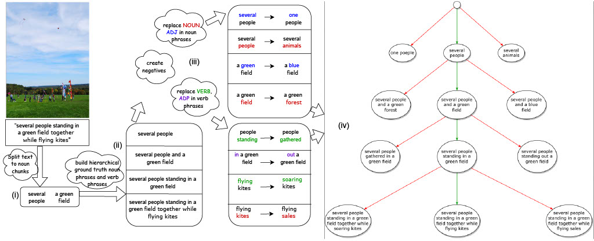
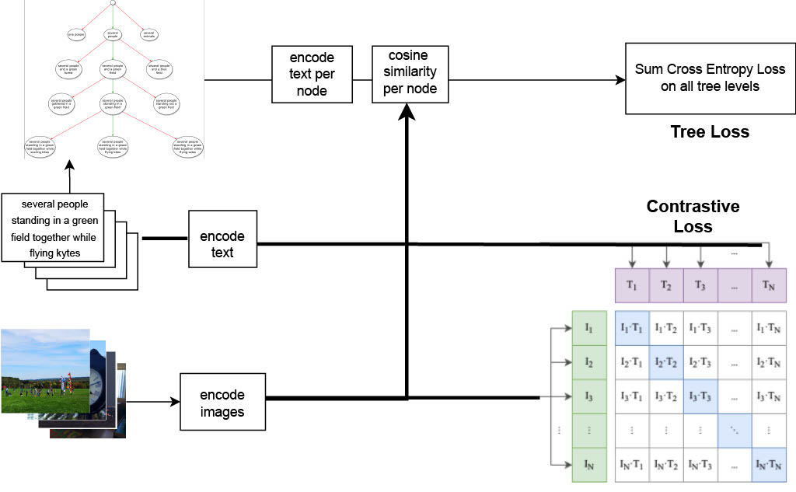
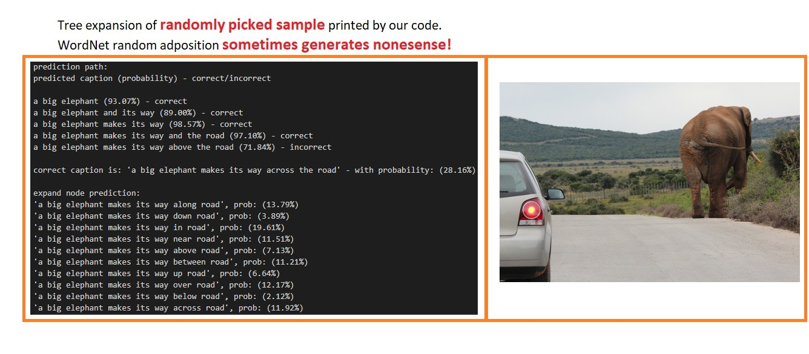
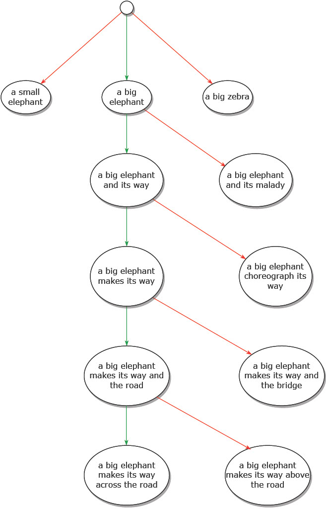

# 3VL: using Trees to teach Vision & Language models compositional concepts

> Nir Yellinek⋆, Leonid Karlinsky†, Raja Giryes⋆
> 
> ⋆ Tel-Aviv University, † MIT-IBM Watson AI Lab
>
> Vision & Language models (VLMs) have proved effective
at aligning image and text representations, producing superior
zero-shot results when transferred to many downstream
tasks. However, these representations suffer some key shortcomings
in Compositional Language Concepts (CLC) understanding
such as recognizing objects’ attributes, states, and relations
between different objects. Moreover, VLMs typically
have poor interpretability, making it challenging to debug and
mitigate compositional-understanding failures. In this work,
we introduce the Tree-augmented Vision & Language (3VL)
model architecture and training technique. By expanding the
text of an arbitrary image-text pair into a hierarchical tree
structure using language analysis tools, 3VL allows inducing
this structure into the visual representation learned by
the model, enhancing its compositional reasoning and interpretability.
Overall, we provide a novel approach for improving
performance and explainablity of VLMs.

  
 
Tree-augmented Vision & Language (3VL) model architecture and training
technique allows for rich exploration of the text space using several levels of incremental text augmentation from coarse to fine-grained. 

## Caption tree generation
1) For each image caption pair we first parse the caption using spaCy to get all noun phrases and part of speech tags.
   
2) Then, we reconstruct the full caption hierarchically to get a positive sub-caption for each level in the tree
   in the following way:

   for the caption: "several people standing in a green field together while flying kytes"
   - The first level of the tree will contain the first noun phrase as its positive text
     (i.e. "several people").
   - The second level of the tree will contain the text of the first and second noun phrases concatenated with some connecting word like 'and'
     (i.e. "several people and a green field").
   - The Third level of the tree will contain the text of the original caption from the start until the end of the second noun phrase
     (e.g. "several people standing in a green field").
   - if more noun phrases exist in the original caption then in a similar way the next levels of the tree will contain the text of previous nouns
     phrases concatenated to the current noun phrase with a word like 'and', and the original caption from the start until the end of the current noun phrase
   - finally, the last level of the tree will contain the text of the full original caption
      (i.e. "several people standing in a green field together while flying kytes").
     
4) Next, for each positive sub-caption we generate one negative caption for each Noun, Adjective, Adposition, and Verb in the sub-caption.

   **_Note_** that we do not replace again words that appeared in previous tree levels. So information from a previous level flows without change.

   for the above example we generate the following negative captions:
   - In the first level we generate "one people", "several animals" (for the positive text "several people").
   - In the second level we generate "several people and a blue field", "several people and a green forest"
      (for the positive text "several people and a green field").
   - In the third level we generate "several people gathered in a green field", "several people standing out a green field" (for the positive text "several people standing in a green field").
   - In the fourth level we generate "several people standing in a green field together while soaring kytes", "several people standing in a green field together while flying sales"
(for the positive text "several people standing in a green field together while flying kytes").
     **_Note_** that our automated negatives generation method can generate grammatical errors sometimes

### Negatives generation

In each negative generation we replace one word of the positive caption, either a Noun, Adjective, Adposition, or Verb. 
Where each negative word is generated as:
1. An opposite (Antonym) of the positive word using FLAN-T5 with prompt (e.g. "find an opposite for the word:
<>”).
2.  If an opposite is not found then we generate a co-hyponym[^1] of the positive word using WordNet.
3.  If a co-hyponym[^1] is not found then we generate a word to fill the masked positive word using    FLAN-T5 (the token 'extra_id_0' replaces the positive word in prompt).

[^1]: A hyponym is a word that have a more specific meaning than its hypernym (the direct ancestor in the wordnet tree). 
  For example, ’apple’ is a hyponym of ’fruit’, and ’fruit’ is the hypernym of ’apple’. 
    Co-hyponyms are words that share the same hypernym in the wordnet tree 
      (e.g. ’apple’ and ’banana’ are co-hyponyms as they share the hypernym ’fruit’; the words ’car’ and ’motorcycle’, ’blue’ and ’yellow’ are co-hyponyms as well.

***see above example for caption tree creation and negatives generation for the caption "several people standing in a green field together while flying kytes".***

  
## Tree based training

  
 
For each image-caption pair, we first create a caption tree. Then, for each level of the tree we calculate the cosine similarity scores between the image and all captions at that level and calculate the Cross Entropy Loss. The final tree loss is the sum of losses over all tree levels.

## Results

   - Top-1 accuracy on VL-Checklist VG Object dataset

        Model    |Location Center      |Location Margin   |Location Mid      |Size Large       |Size Medium     |Size Small     |Avg
        ---------|:---------:|----------:|----------:|-----------:|----------:|----------:|----------:|----:
         CLIP        |86.95      |77.75      |72.75       |85.50      |80.50      | 70.60     |79.01
         RB+LLM Negs |91.70      |83.20      |78.90      |90.30       |84.55      |77.00     |84.34
         3VL        |**_93.82_**      |**_85.02_**      |**_89.48_**      |**_94.96_**       |**_88.61_**         **_83.78_**      | **_89.28_**

          Model    |Location Center      |Location Margin   |Location Mid      |Size Large       |Size Medium     |Size Small     |Avg
     ---------|:---------:|----------:|----------:|-----------:|----------:|----------:|----------:|----:
      CLIP        |86.95      |77.75      |72.75       |85.50      |80.50      | 70.60     |79.01
      RB+LLM Negs |91.70      |83.20      |78.90      |90.30       |84.55      |77.00     |84.34
      3VL        |**_93.82_**      |**_85.02_**      |**_89.48_**      |**_94.96_**       |**_88.61_**      **_83.78_**      | **_89.28_**  
    
   - dfg

### Downstream tasks

We report results of several downstream tasks with the Original CLIP model replaced by our 3VL.

1. Image/Text retrieval

     - Image2Text on COCO 2017 validation set:

    
         | Model       | R@1         | R@5         | R@10   |
         | ------------|:-----------:| -----------:|-------:|
         | CLIP        | 32.54       | 57.7        | 68.08
         | RB+LLM Negs | 32.56       | 57.84       | 68.06
         | 3VL         | **_33.72_** | **_62.08_** |**_73.12_**
    
     - Text2Image on COCO 2017 validation set:

         | Model       | R@1         | R@5         | R@10   |
         | ------------|:-----------:| -----------:|-------:|
         | CLIP        | 28.66       | 53.04       | 64.44
         | RB+LLM Negs | 28.58       | 53.12       | 64.42
         | 3VL         | **_36.54_** | **_63.32_** |**_74.48_**
    
     - Image2Text on FLICKR test set:

  
         | Model       | R@1      | R@5        | R@10   |
         | ------------|:--------:| ----------:|-------:|
         | CLIP        | 69.5     | 90.1       | 95
         | RB+LLM Negs | 58.9     | 86.3       | 92.5
         | 3VL         | **_71_** | **_91.1_** |**_95.3_**
  
   
     - Text2Image on FLICKR test set:

   
         | Model       | R@1      | R@5        | R@10   |
         | ------------|:--------:| ----------:|-------:|
         | CLIP        | 67       | 89.5       | 68.08
         | RB+LLM Negs | 67       | 89.5       | 93.8
         | 3VL         | **_74_** | **_93.5_** |**_96.1_**   

   
2. Image segmentation using SegCLIP[[1]](#1)

    - Segmentation performance on PhraseCut: 

    
         | Model       | IoUFG | IoUBIN| 
         | ------------|:----------------:| ----------------:|
         | CLIP        | 52.4             | 71.7             | 
         | RB+LLM Negs | 51.7             | 69.8             | 
         | 3VL         | **_53.4_**       | **_72.1_**       |
      
    
     - Segmentation performance on COCO:

         | Model       | IoUFG | IoUBIN| 
         | ------------|:----------------:| ----------------:|
         | CLIP        | 54.8             | 73.2             | 
         | RB+LLM Negs | 55.2             | 73.4             | 
         | 3VL         | **_57.2_**       | **_74.7_**       |

   
### Using 3VL for interpretability
>To offer extra insight into model decision, we expand the caption
>tree at the level in which the model failed, with extra generated positive and negative words and check model image-text matching probability for all these words.

  
 
Example of Caption tree expansion after failed adposition

  
 
Original Caption tree   

## Ablations

1. **Top-1 accuracy on VL-Checklist when constraining **3VL** tree to max depth**

 Depth    |Att color      |Att material      |Att size      |Att action       |Att state      |Rel action     |Rel spatial      
|---------|:---------:|----------:|----------:|-----------:|----------:|----------:|----------:|
|1        |72.70       |78.42      |69.28      |78.81       |70.99      |78.54      | 74.10     |
|2        |72.99       |79.51      |69.24      |79.81       |72.90      |79.04      | 74.49     |
|3        |73.27       |79.43      |68.68      |80.97       |72.79      |80.99      | 78.55     |
|unlimited|**_75.57_** |**_82.63_**|**_70.72_**|**_81.10_**|**_75.35_** |**_81.94_**|**_81.15_**|

2. **Caption Tree Variants**
   
>In the tree training process, we have explored many variants of caption tree structure formation that can be used with 3VL, different negatives generation methods and their combinations.
>   - **Tree structures.** We explored two main tree structures: 
>      - (**i**) basic tree structure (**_"Basic"_**) where each noun phrase appears alone in different tree levels and the full caption in the last tree level
>        (**e.g.** for the above example we will get a tree with 3 levels. **_"several people"_**  in the first level, **_"a green field"_** in the second level, and **_"several people standing in a green field together while flying kytes"_** in the third level)
>      - (**ii**) incremental tree structure (**_"Incremental"_**) where each noun phrase is prepended once with previous tree level text only and once with previous tree level text plus the text that connects to the current noun phrase (verbs and adpositions).
>        (**e.g.** for the above example we will get a tree with 3 levels. **_"several people"_**  in the first level, **_"several people and a green field"_** in the second level, , **_"several people standing in a green field"_** in the third level, and **_"several people standing in a green field together while flying kytes"_** in the fourth level)

>   - **Negatives generation.** We explored three main methods:
>      - (**i**) using WordNet (**_"WN"_**) replace nouns and verbs with co-hyponyms and replace adjectives and adpositions with antonyms or with random adjective or adposition.
>      - (**ii**) **_"LLM prompt"_** - we generate co-hyponyms, antonyms and random adjective or adposition with prompt to FLAN-T5 (e.g., "find an opposite for the word: <>").
>      - (**iii**) LLM mask completion (**_"LLM mask"_**) - generates a negative word by replacing a positive word with a mask token and passing it to FLAN-T5 LLM for mask completion.
>        Other variants included also replacing only nouns or verbs with mask completion.

In the table below we report Top-1 accuracy results on VL-Checklist with four such tree variants.
   - (**i**) "**_Basic WN_**" - Basic tree with WordNet replacement
   - (**ii**) "**_Incremental WN_**" - Incremental tree structure with WordNet replacement.
   - (**iii**) "**_WN+LLM prompt+mask_**" - Incremental tree, FLAN-T5 prompt for opposites, FLAN-T5 mask completion if opposite doesn’t exist and WordNet replacement if mask completion did not generate a word with a different meaning.
   - (**iv**) "**_WN+LLM prompt+mask_**" - Incremental tree, FLAN-T5 prompt for opposites, and WordNet replacement if the opposite does not exist.

 Tree Method    |Att color      |Att material      |Att size      |Att action       |Att state      |Rel action     |Rel spatial| Avg      
|---------|:---------:|----------:|----------:|-----------:|----------:|----------:|----------:|----:
|**_Basic WN_**        |70.54      |75.79      |69.72      |75.95       |70.46      |81.81      | 73.94     |74.03
|**_Incremental WN_**        |74.41      |79.23      |70.13      |78.12       |71.63      |**_83.81_**| 75.70     |76.15
|**_WN+LLM prompt+mask_**        |72.31      |77.53      |69.98      |76.69       |69.39      |83.43      | 76.87     |75.17
|**_WN+LLM prompt+mask(3VL)_**|**_75.57_**|**_82.63_**|**_70.72_**|**_81.10_**|**_75.35_** |81.94      |**_81.15_**|**_78.35_**  

 Model                   | Att color | Att material | Att size | Att action |Att state |Rel action |Avg      
|------------------------|:---------:|----------:|----------:|-----------:|----------:|----------:|----------:|----:
|**_Basic WN_**           |70.54      |75.79      |69.72      |75.95       |70.46      |81.81      | 73.94 
|**_Incremental WN_**     |74.41      |79.23      |70.13      |78.12       |71.63      |**_83.81_**|76.15
|**_WN+LLM prompt+mask_** |72.31      |77.53      |69.98      |76.69       |69.39      |83.43      | 76.87 

   
   
3. sdf

### User study

## References
<a id="1">[1]</a> 
Timo L ̈uddecke and Alexander Ecker, “Image segmentation using text and image prompts,” in Proceedings of
the IEEE/CVF Conference on Computer Vision and Pattern Recognition (CVPR), June 2022, pp. 7086–7096.

